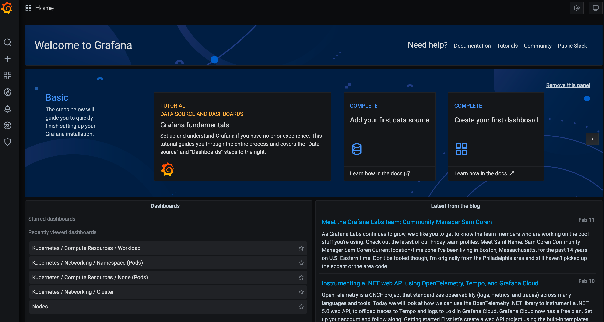
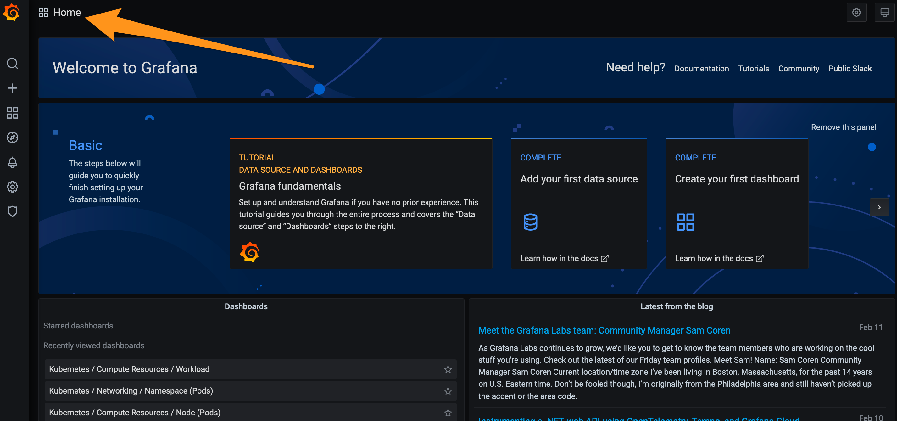
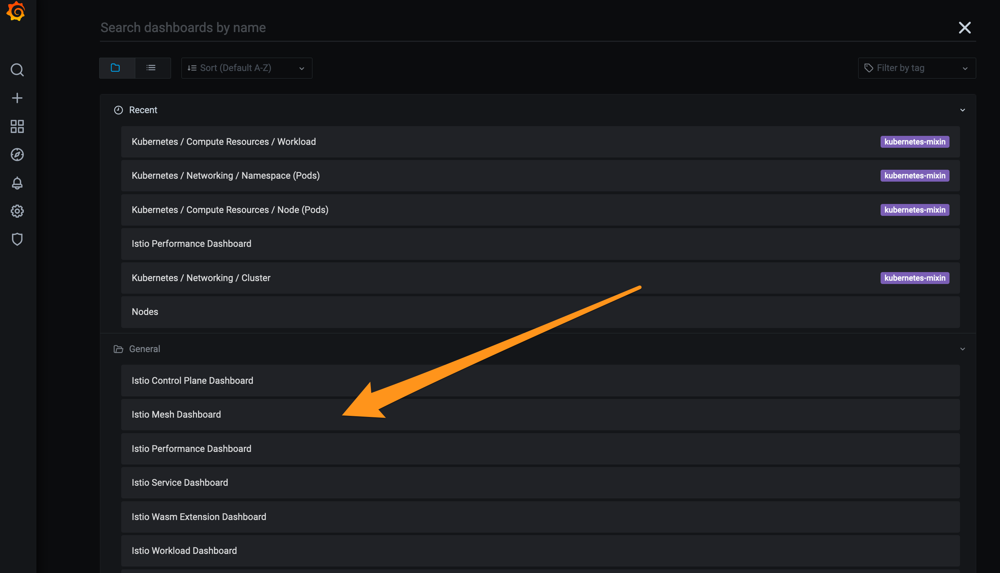
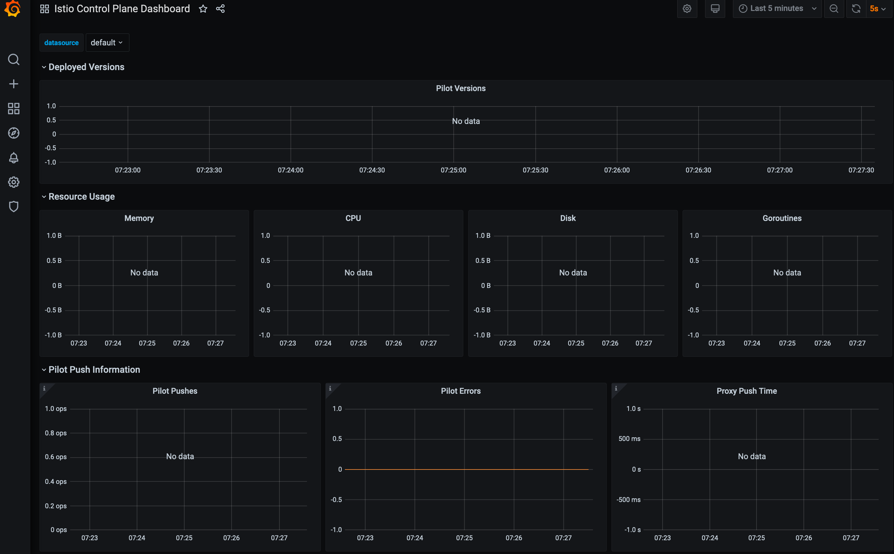
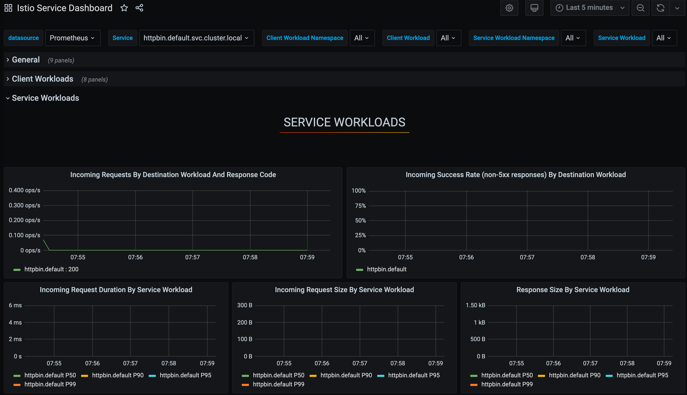
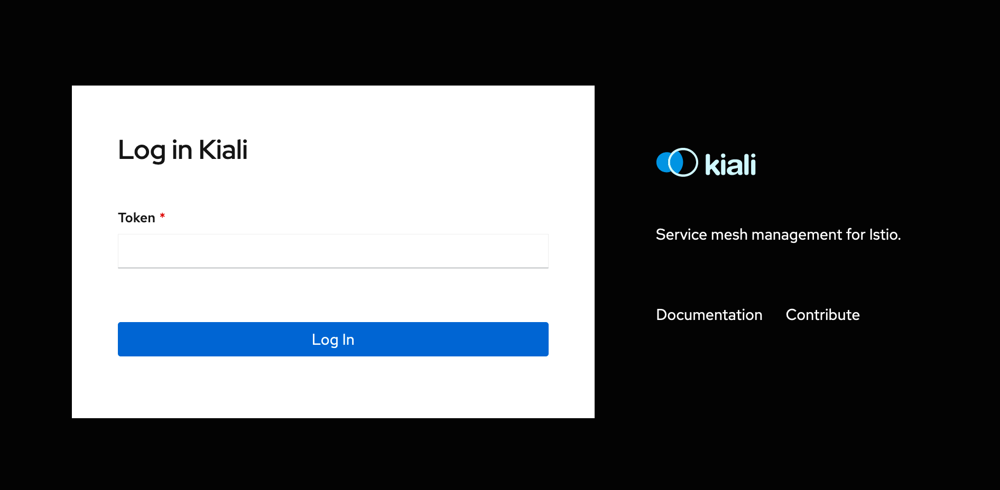
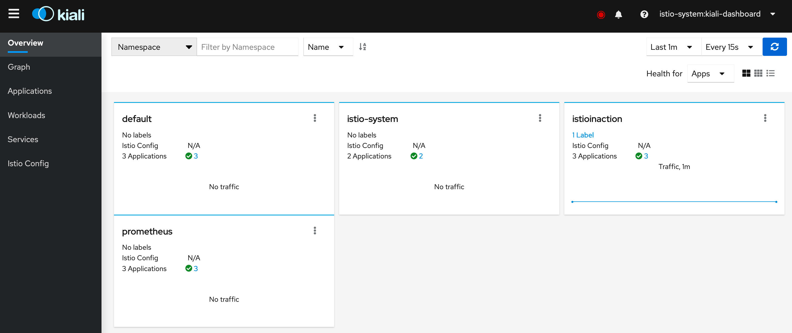

# Lab 3 :: Connecting to observability systems

One of the most powerful parts of Istio is using the mesh to quickly troubleshoot and diagnose issues that inevitably come up in microservices networking. Where are requests slowing down? Where are they failing? Where are things becoming overloaded? Having something like Envoy proxy in the request path on both sides of a transport between services acts like a flood light to help uncover these issues.

We saw in Lab 01 that Envoy surfaces a large set of stats, metrics, guages, and histograms. In this lab we look at connecting that source of information to an observability system. In many ways the mesh makes these systems more valuable.

Istio comes with a few [sample addons](https://istio.io/latest/docs/ops/integrations/prometheus/#option-1-quick-start) for adding observability components like Prometheus, Grafana, and Kiali. In this lab **we will assume you are not going to use these components** as they are intended for very simple deployments and **not intended for a realistic production setup**. We will install something that looks more realistic and use that.


Istio's sample addons for Prometheus, Grafana, Kiali, etc are NOT intended for production usage. This guide will walk through a setup more production like.


## Prerequisites

Verify you're in the correct folder for this lab: `~/istio-workshops/istio-day2/1-deploy-istio/`.

We will be using a realistic observability system that uses Prometheus and many other components out of the box called [kube-prometheus](https://github.com/prometheus-operator/kube-prometheus). This project tries to curate and pre-integrate a realistic deployment, highly available deployment of Prometheus with the Prometheus operator, Grafana, and a lot of ancillary pieces like alertmanager, node-exporters, adapters for the Kube API, and others. Please see the [kube-prometheus](https://github.com/prometheus-operator/kube-prometheus) docs for more.

We will be using the [helm](https://github.com/prometheus-community/helm-charts/tree/main/charts/kube-prometheus-stack) charts to install `kube-prometheus`. Just note, for this lab we will slightly trim down the number of components installed to stay within some of our VM resource limits (specifically for the instructor-led labs.. on your own cluster, carry on :) ).

## Install kube-prometheus and highly-available Prometheus

To get started, let's create the namespace into which we'll deploy our observability components:

```bash
kubectl create ns prometheus
```

Next, let's add the promoetheus community chart repo and then update available helm charts locally.

```bash
helm repo add prometheus-community https://prometheus-community.github.io/helm-charts
helm repo update
```

Next, let's run the helm installer. We are disabling some components of `kube-prometheus` while still keeping the overall spirit of the realistic deployment. To do this, we'll pass in a `values.yaml` file that explicitly controls what gets installed. Feel free to review this file to understand it a bit more.

```bash
helm install prom prometheus-community/kube-prometheus-stack --version 13.13.1 -n prometheus -f labs/03/prom-values.yaml
```


This command may take a few moments to complete; be patient.


At this point, we should have a successfully installed prometheus. To verify the components that were installed to support observability for us, let's check the pods:

```bash
kubectl get po -n prometheus
```

```
NAME                                                   READY   STATUS    RESTARTS   AGE
prom-grafana-5ff645dfcc-qp57d                          2/2     Running   0          21s
prom-kube-prometheus-stack-operator-5498b9f476-j6hjc   1/1     Running   0          21s
prom-kube-state-metrics-5f8c8f78bc-hf5m6               1/1     Running   0          21s
prom-prometheus-node-exporter-7rs7d                    1/1     Running   0          21s
prometheus-prom-kube-prometheus-stack-prometheus-0     2/2     Running   1          17s
```

Let's quickly port-forward the Prometheus deployment and verify we can connect to it:

```bash
kubectl -n prometheus port-forward statefulset/prometheus-prom-kube-prometheus-stack-prometheus 9090
```

Now go to [http://localhost:9090/](http://localhost:9090) to verify you can get to the Prometheus dashboard:


Press `ctrl+C` to end the port forwarding and let's try the same thing for the Grafana dashboard:

```bash
kubectl -n prometheus port-forward svc/prom-grafana 3000:80
```

Now go to [http://localhost:3000/](http://localhost:3000) to verify you can get to the Grafana dashboard. You should be greeted with the Grafana login screen.

Login with the following credentials:

- Username: `admin`
- Password: `prom-operator`

Now you should see the main dashboard like this:



Feel free to poke around and see what dashboards are available with this default set up (note some dashboards we have disabled in the original deployment when we cut down some of the components -- at least in the instructor-led workshop).


If you're unfamiliar with Grafana, you should start by clicking the "Home" button on the top left of the main screen


## Add Istio Dashboards to Grafana

There are out of the box Grafana dashboards that Istio includes with its [sample version of the Grafana installation](https://istio.io/latest/docs/ops/integrations/grafana/#option-1-quick-start). As mentioned earlier in the lab, this is intended for demonstration purposes only not for production.

As we've installed Grafana in a more realistic scenario, we should figure out how to get the Istio Grafana dashboards into our deployment of Grafana. The first step is to [get the dashboards from the Istio source repo](https://github.com/istio/istio/tree/master/manifests/addons/dashboards).

In this lab, we have them pre-downloaded into `labs/03/dashboards`. To get them to work with our-installed Grafana, we need to import them as `configmaps`. Run the following, kinda-long, command to do this:

```bash
kubectl -n prometheus create cm istio-dashboards \
--from-file=pilot-dashboard.json=labs/03/dashboards/pilot-dashboard.json \
--from-file=istio-workload-dashboard.json=labs/03/dashboards/istio-workload-dashboard.json \
--from-file=istio-service-dashboard.json=labs/03/dashboards/istio-service-dashboard.json \
--from-file=istio-performance-dashboard.json=labs/03/dashboards/istio-performance-dashboard.json \
--from-file=istio-mesh-dashboard.json=labs/03/dashboards/istio-mesh-dashboard.json \
--from-file=istio-extension-dashboard.json=labs/03/dashboards/istio-extension-dashboard.json
```

Lastly, we need to label this `configmap` so that our Grafana picks it up:

```bash
kubectl label -n prometheus cm istio-dashboards grafana_dashboard=1
```

If we port-forward our Grafana dashboard again, we can go find our new Istio dashboards:

```bash
kubectl -n prometheus port-forward svc/prom-grafana 3000:80
```

Login to [http://localhost:3000](http://localhost:3000) with `admin`/`prom-operator` and on the main screen click the "Home" link on the top left part of the dashboard:



From here, you should see the new Istio dashboards that have been added:




It may take a few moments for the dashboards to appear


Click the "Control Plane" dashboard. You should be taken to a dashboard with some interesting graphs:



Actually, the graphs are all empty!! This is not of much value to us, so let's figure out how to populate these graphs.


It may take quite a few minutes for data to populate into the Grafana dashboards. In practice, it may be worth moving on to other parts and coming back later to check the data in the dashboards.


## Scraping the Istio service mesh: control plane

The reason we don't see any information in the Control Plane dashboard (or any of the Istio dashboards really) is because we don't have any configuration for scraping information from the Istio service mesh.

To configure Prometheus to do this, we will use the Prometheus Operator CRs `ServiceMonitor` and `PodMonitor`. These Custom Resources are described in good detail in the [design doc on the Prometheus Operator repo](https://github.com/prometheus-operator/prometheus-operator/blob/master/Documentation/design.md).

Here's how we can set up a `ServiceMonitor` to scrape the Istio control-plane components:

```yaml
apiVersion: monitoring.coreos.com/v1
kind: ServiceMonitor
metadata:
  name: istio-component-monitor
  namespace: prometheus
  labels:
    monitoring: istio-components
    release: prom
spec:
  jobLabel: istio
  targetLabels: [app]
  selector:
    matchExpressions:
      - { key: istio, operator: In, values: [pilot] }
  namespaceSelector:
    any: true
  endpoints:
    - port: http-monitoring
      interval: 15s
```

Let's apply it:

```bash
kubectl apply -f labs/03/monitor-control-plane.yaml
```

At this point we will start to see important telemetry signals about the control plane such as the number of sidecars attached to the control plane, whether there are configuration conflicts, the amount of churn in the mesh, as well as basic memory/CPU usage of the control plane.


As mentioned earlier, it may take a few minutes for these signals to start to make it into the Grafana dashboards, so be patient :)


Since there aren't very many workloads (just our `httpbin` service we installed for testing), we won't see too much data.

## Scraping the Istio service mesh: data plane

If we go check a different dashboard like "Istio Service Dashboard", we will see it's empty as there aren't any rules set up to scrape the data plane yet.

Just like we did in the previous section, we need to enable scraping for the data plane. To do that, we'll use a `PodMonitor` that looks like this:

```yaml
apiVersion: monitoring.coreos.com/v1
kind: PodMonitor
metadata:
  name: envoy-stats-monitor
  namespace: prometheus
  labels:
    monitoring: istio-proxies
    release: prom
spec:
  selector:
    matchExpressions:
      - { key: istio-prometheus-ignore, operator: DoesNotExist }
  namespaceSelector:
    any: true
  jobLabel: envoy-stats
  podMetricsEndpoints:
    - path: /stats/prometheus
      interval: 15s
      relabelings:
        - action: keep
          sourceLabels: [__meta_kubernetes_pod_container_name]
          regex: "istio-proxy"
        - action: keep
          sourceLabels:
            [__meta_kubernetes_pod_annotationpresent_prometheus_io_scrape]
        - sourceLabels:
            [__address__, __meta_kubernetes_pod_annotation_prometheus_io_port]
          action: replace
          regex: ([^:]+)(?::\d+)?;(\d+)
          replacement: $1:$2
          targetLabel: __address__
        - action: labeldrop
          regex: "__meta_kubernetes_pod_label_(.+)"
        - sourceLabels: [__meta_kubernetes_namespace]
          action: replace
          targetLabel: namespace
        - sourceLabels: [__meta_kubernetes_pod_name]
          action: replace
          targetLabel: pod_name
```

Let's create it:

```bash
kubectl apply -f labs/03/monitor-data-plane.yaml
```

Let's also generate some load to the data plane (by calling our `httpbin` service) so telemetry will show up:

```bash
for i in {1..10}; do kubectl exec -it deploy/sleep -n default -- curl http://httpbin.default:8000/headers; done
```

We could also use a load generator tool to put more load on the system over a period of time.

Now we should be scraping the data-plane workloads. If we check the Istio Service Dashboard, specifically the "Service Workload" section, we should start to see load.


As mentioned earlier, it may take a few minutes for these signals to start to make it into the Grafana dashboards, so be patient :)




If we go back and look at the Control Plane dashboard, we should see those XDS graphs now populated:


## Installing Kiali

Kiali is a networking graph dashboard that shows connectivity paths between services. This is different than a Grafana graph that shows line charts, bar graphs, etc. Kiali gives a visual representation of the services and how the connect to each other. More [can be found on the Kiali website](https://kiali.io).

Again, Istio ships with a [sample version of Kiali out of the box](https://istio.io/latest/docs/ops/integrations/kiali/#option-1-quick-start) but for realistic deployments, the Istio and Kiali teams recommend using the [Kiali Operator](https://github.com/kiali/kiali-operator)

For more details on installing Kiali, please see the [official install guide](https://kiali.io/documentation/latest/installation-guide/).

Let's install the `kiali-operator` here:

```bash
kubectl create ns kiali-operator
```

```bash
helm install \
    --set cr.create=true \
    --set cr.namespace=istio-system \
    --namespace kiali-operator \
    --repo https://kiali.org/helm-charts \
    --version 1.29.1 \
    kiali-operator \
    kiali-operator
```


You may see helm complain about some parts of the Kiali install; you can ignore those for now and verify the Kiali Operator got installed correctly


At this point we have the Kiali operator installed. Let's check that it's up and running:

```bash
kubectl get po -n kiali-operator
```

```
NAME                              READY   STATUS    RESTARTS   AGE
kiali-operator-67f4977465-rq2b8   1/1     Running   0          42s
```

Now that the operator is installed, we need to declare an instance of Kiali to install and run. We will do that with the `Kiali` CR:

```yaml
apiVersion: kiali.io/v1alpha1
kind: Kiali
metadata:
  namespace: istio-system
  name: kiali
spec:
  istio_namespace: "istio-system"
  istio_component_namespaces:
    prometheus: prometheus
  auth:
    strategy: token
  deployment:
    accessible_namespaces:
      - "**"
    image_version: operator_version
  external_services:
    prometheus:
      cache_duration: 10
      cache_enabled: true
      cache_expiration: 300
      url: "http://prom-kube-prometheus-stack-prometheus.prometheus:9090"
```

Kiali leverages the telemetry signals that Prometheus scrapes from the Istio control plane and data plane. In the previous sections we installed Prometheus, but for Kiali, we need to configure it to use our specific Prometheus. In the configuration above you should see we configure Kiali to use Prometheus at `http://prom-kube-prometheus-stack-prometheus.prometheus:9090`. You may be wondering how to secure the connection between Kiali and Prometheus? Actually Prometheus doesn't come with any out of the box security strategies. They recommend running a reverse proxy (Envoy?!) in front of it. From Kiali we can use TLS and basic auth to connect to Prometheus. This is left as an exercise for the workshop attendee.

Note, we are installing this Kiali dashboard with Token Auth but there are various ways to configure Kiali. [In this blog post](https://www.solo.io/blog/securing-kiali-in-istio-1-7/), we dig deeply into using OIDC, but we definitely recommend checking the official documentation for [Kiali installations and auth strategies](https://kiali.io/documentation/latest/configuration/authentication/).

Let's create the Kiali instance:

```bash
kubectl apply -f labs/03/kiali.yaml
```


You may see kubectl complain about the manner in which we apply this resource; you can safely ignore it for this lab


Let's check that it got created:

```bash
kubectl get po -n istio-system
```

```shell
NAME                            READY   STATUS    RESTARTS   AGE
istiod-1-8-3-78b88c997d-rpnck   1/1     Running   0          39h
kiali-67cd5cf9fc-lnwc9          1/1     Running   0          29s
```

Now let's port-forward the Kiali dashboard:

```bash
kubectl -n istio-system port-forward deploy/kiali 20001
```

And now you can navigate to [http://localhost:20001](http://localhost:20001).

You are greeted with a login page when you get there:



How do we login here? We configured Kiali to use the [token auth](https://kiali.io/documentation/latest/configuration/authentication/token/) strategy which is similar to securing the default Kubernetes dashboard. Let's create the service-account token and RBAC so we can login:


Some times the lab machines can have issues with copy/paste of the token; you can switch to `anonymous` login with the file `labs/03/kiali-no-auth.yaml` if you need to


```bash
kubectl create serviceaccount kiali-dashboard -n istio-system
```

```bash
kubectl create clusterrolebinding kiali-dashboard-admin --clusterrole=cluster-admin --serviceaccount=istio-system:kiali-dashboard
```

Getting the token:

```bash
kubectl get secret -n istio-system -o jsonpath="{.data.token}" $(kubectl get secret -n istio-system | grep kiali-dashboard | awk '{print $1}' ) | base64 --decode
```

Copy and paste that token into the Kiali login screen. Once you login, you should be greeted with the Kiali dashboard:



Congrats! You've installed and secured the Kiali dashboard and connected it to the Prometheus instance collecting Istio telemetry.
In the next few labs, we'll introduce our services to the mesh and send traffic through them. We should see Kiali populated with information at that point.

## Recap

In this lab we've set up one of the most important parts of running a service mesh: the observability systems around it.
At this point we should have a good understanding of the Istio data plane, have the control plane installed, and now have a realistic observability system.

## Bonus Content

In the bonus section, we dig into the observability system as well as some tips and tricks for how Istio handles metrics provided by the application.

[See the Lab 03 bonus section](03a-bonus.md).

## Next Lab

In the [next lab](04-ingress-gateway.md), we will leverage Istio's ingress gateway to secure an edge service and share some tips on how to configure and debug the gateway.
